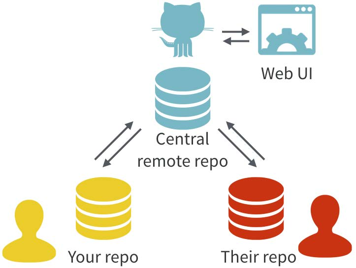
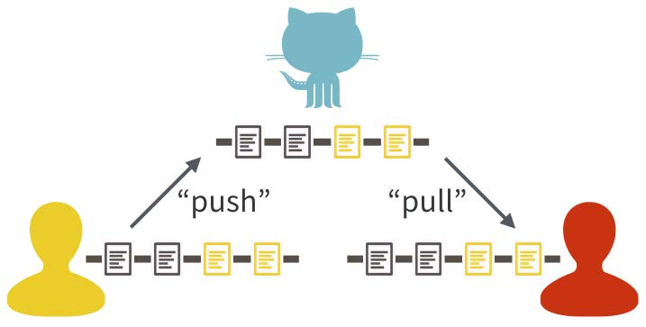
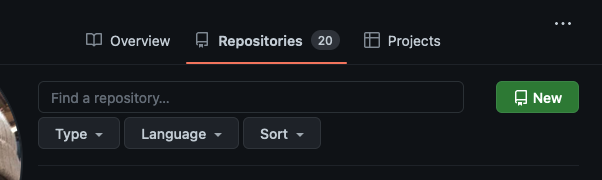

Git Basics
================
Jeronimo Rodriguez-Escobar
2023-02-28

# Git

**NOTE**. This is an ongoing document, it is not complete and can be
improved, but it already has some basic instructions. Is part of a
repository contained [**here**](https://github.com/Cumaribo/tutorials).

Git is a *distributed version control* system. This
[**document**](https://www.google.com/url?sa=t&rct=j&q=&esrc=s&source=web&cd=&cad=rja&uact=8&ved=2ahUKEwjvhMWpo__7AhX4mXIEHem0DU4QFnoECA8QAQ&url=https%3A%2F%2Fpeerj.com%2Fpreprints%2F3159.pdf&usg=AOvVaw1G8aYNwj329N3GzC7pBSOQ)
has a great introduction on Version control.

Git was originally developed to *to help groups of developers work
collaboratively on big software projects*.

Its purpose is to manage the evolution of a group of files (known as
*repo*). (Track changes on steroids)

In Data Science, it is used to manage all the files associatd with a
data management project in a more structured manner:

- Keeps all files together
- Keeps track of all changes and allows to go back in time
- Useful to keep updated versions among multiple machines/users
- Facilitates teamwork and publishing

This [**video**](https://www.youtube.com/watch?v=USjZcfj8yxE) explains
in very basic terms what git is about and the basic operations:

- git init
- git status
- git commit
- git branch
- git push
- git pull
- git fetch

## Installation.

Find instructions to install Git
[**here**](https://github.com/git-guides/install-git), in case it is not
installed in your computer yet. Check if Git is installed with this
command:

``` bash
$ git --version
```

Git can be used directly on the command line or trough GUIs. RStudio
offers a very very intuitive approach. Instructions for setting it up
are [**here**](https://support.posit.co/hc/en-us/articles/200532077)

### Seting the user

``` bash
$ git config --global user.name "Jeronimo Rodriguez"
$ git config --global user.email jeronimo.rodriguez@temple.edu
```

### Check Settings

``` bash
$ git config --list
```

### Setting the editor

I set EMACS as the default editor, it is not the only option, but the
one I am familiar with

``` bash
$ git config --global core.editor emacs
```

### Starting a new repository

``` bash
$ git init
```

### Check the Git Status

``` bash
$ git status
```

### Git Commit

``` bash
$ git commit
```

### Create new branch

``` bash
$ git checkout -b master
```

``` bash
$ git branch
# Connecting to GitHub
```

### Shift between branches

(from current to test1)

``` bash
$ git checkout test1
```

# GitHub

It is very common to threat Git and Github indistinctly as the same
thing, it is important to consider their relartionship:  
*GitHub complements Git by providing a user interface and a distribution
mechanism for Git repositories*

- Git is the software that records changes to a set of files.
- GitHub is a hosting service that provides a Git-aware home for such
  projects on the internet. (Bryan, 2017)





# Connecting with the Remote GitHub Repository

This
[link](https://docs.github.com/en/get-started/getting-started-with-git/caching-your-github-credentials-in-git)
has the instructions to set the log in credential from your machines. It
depends on the OS. It can be confusing at the beginning (it was and
still is for me), because there are several ways to set it up (token,
ssh, 2fA, password) and it is easy to forget. Insdtead of creating new
instructions, just follow the instuctions. If you still experiment
issues, contact me.

# Adding locally created repositories to GitHub

In my opinion, the most common and intuitive way to start working in
GitHub is by creating a repositoty on the website. However, it might be
better to create if from the R project and then [adding a remote
repository](https://docs.github.com/en/get-started/getting-started-with-git/managing-remote-repositories)
In this operation, what happens is that the new repository, created
together with the new proyect will be stored in the GitHub server. This
has three main purposes:

- Get a backup for you code outside your local machine
- Track changes and the evolution of the software and workflows you are
  developing
- Synchronize between multiple workstations and users

These are the main strengths of the Distributed Version Control Systems
(DVCS) \## Create a new repository on the GitHub website



2 Go tho the Terminal tab, next to *Console* in your RStudio GUI

``` bash
$ git remote add origin https://github.com/USER/REPO.git
# Change /USER/REPO for your user and the name of the repository on GitHub 
$ git remote -v
# Verify new remote
> origin  https://github.com/USER/REPO.git (fetch)
> origin  https://github.com/USER/REPO.git (push)
```

Depending on the method set to authenticate, the console might ask to
the credentials Once the repository is created and synchronized on
ghithub, you can clone it in other machines, set privacy or invite
others to cooperate.

Tho add a local repository and start thracking:

``` bash
# Check git status
git status
# add (stash) changes. Add each filename separated by coma
git add script1.R, script2.R .....
# to add all files:
git add --a
# commit changes
git commit # don't forget to add comment. Else the commit will not occur. Make sure to include meaningful comments here, this is key to be track, check advances.
# Set remote repository url (in case you have not done so)
$ git remote add origin https://github.com/USER/REPO.git
# Set remote repository as origin (this only needs to be done once) and push to remote
$ git push --set-upstream origin master
```

# GitHub and RStudio

The basic git operations can be easilty run directly from RStudio. There
is a nice intergration between them. The basics can be found
[**here**](https://resources.github.com/github-and-rstudio/).
